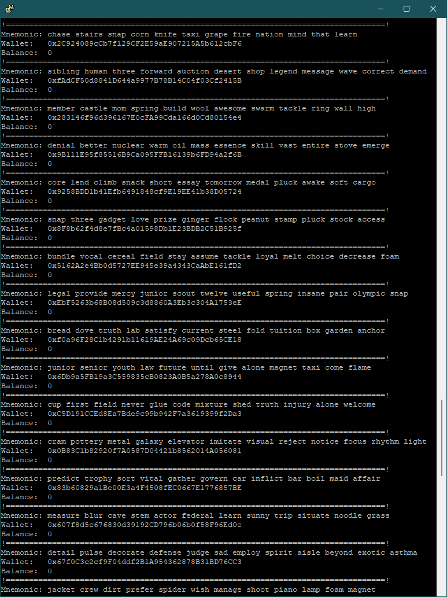

Required Python < 3.10

#  ETHBreaker by VolkiTech

## Added support for Telegram (by aiogram)
MEW network for checking balance
MultiThreading
Check childs of wallet
12 / 24 Words for wallet
Proxy list
Send address of wallet to Telegram or save in file
Install modules: pip install -r requirements.txt

